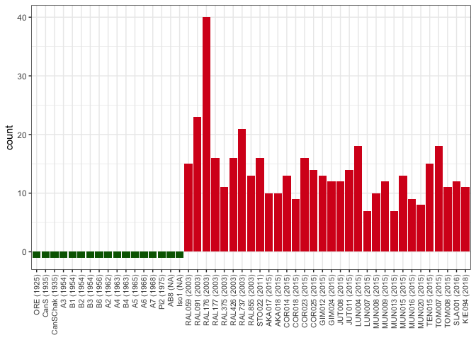

Gonzalez - analysis (MCTE)
================
roko
9/8/2023

# Prepare

``` bash
# merge all clean files
for i in *ori.out; do awk '{print $0,FILENAME}' $i |perl -pe 's/\.fa\.ori\.out//'
for i in *ori.out.clean; do awk '{print $0,FILENAME}' $i |perl -pe 's/\.fa\.ori\.out\.clean//'; done > merged.clean.sum
python summarize-Spoink-insertions.py --sum merged.clean.sum > longread-summary.txt
```

## extract degraded stuff into separate file

``` bash
# similarity to Spoink between 25 and 5%
# length fraction between 0.1 and 0.8
cat merged.clean.sum |awk '$3<25 && $3>5 && $11<0.8 && $11>0.1' > degraded.shit.txt    
```

# Visualize

``` r
library(tidyverse)
```

    ## ── Attaching packages ─────────────────────────────────────── tidyverse 1.3.1 ──

    ## ✔ ggplot2 3.3.6     ✔ purrr   0.3.4
    ## ✔ tibble  3.1.7     ✔ dplyr   1.0.9
    ## ✔ tidyr   1.2.0     ✔ stringr 1.4.0
    ## ✔ readr   2.1.2     ✔ forcats 0.5.1

    ## ── Conflicts ────────────────────────────────────────── tidyverse_conflicts() ──
    ## ✖ dplyr::filter() masks stats::filter()
    ## ✖ dplyr::lag()    masks stats::lag()

``` r
theme_set(theme_bw())
h<-read.table("/Users/rokofler/analysis/2023-Spoink/Dmel-Spoink/2023-09-Dmel-LR-assemblies/rawori/longread-summary.txt",header=F)


# GIM012    2015    Europe  consensus   13
# GIM012    2015    Europe  degraded    18
# COR014    2015    Europe  consensus   13
names(h)<-c("strain","year","continent","frag","count")
h[is.na(h$year),]$year<-2000
h$name<-paste0(h$strain," (",h$year,")")
h[h$year==2000,]$name<-paste0(h[h$year==2000,]$strain," (NA)")
h$frag<-recode_factor(h$frag,consensus="full length",degraded="degraded")

h<-as_tibble(h)

p<- ggplot(h,aes(y=count,x=reorder(name,year),fill=continent))+geom_bar(stat="identity")+facet_grid(frag~.)+ylab("count")+
 theme(axis.title.x=element_blank(),axis.text.x = element_text(angle = 90, vjust = 0.5, hjust=1,size=8))
plot(p)
```

<!-- -->

``` r
h<-subset(h,frag=="full length")
h$ap<-"abs"
h[h$count>0,]$ap<-"pres"
h[h$count==0,]$count<- -1

#

p<- ggplot(h,aes(y=count,x=reorder(name,year),fill=ap))+geom_bar(stat="identity")+ylab("count")+
  scale_fill_manual(values=c("#016301","#D71E1E"))+
 theme(legend.position = "none", axis.title.x=element_blank(),axis.text.x = element_text(angle = 90, vjust = 0.5, hjust=1,size=8))
plot(p)
```

<!-- -->

``` r
pdf("/Users/rokofler/analysis/2023-Spoink/Dmel-Spoink/2023-09-Dmel-LR-assemblies/graphs/lr-timeline.pdf",width=7,height=3)
plot(p)
dev.off()
```

    ## quartz_off_screen 
    ##                 2
