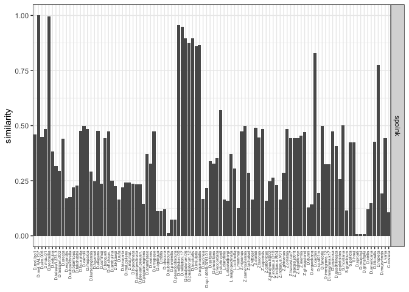
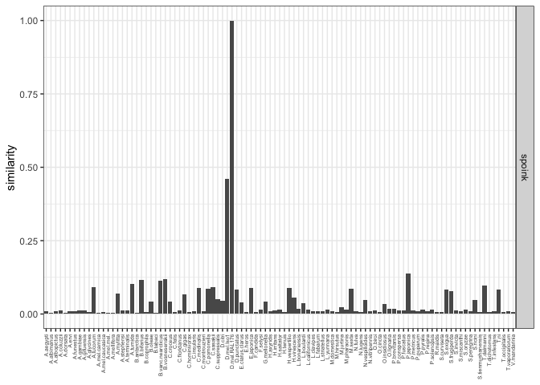

Gonzalez - analysis (MCTE)
================
roko
9/8/2023

# Prepare

# RepeatMask

## Sequence check

``` bash
ll seq
-rw-r--r--  1 fschwarz  staff   362 Sep 13 09:51 spoink-dmel-LTR_v1.fasta
-rw-r--r--  1 fschwarz  staff  5225 Sep 13 09:51 spoink-dmel-consensus_v1.fasta

# md5 of sequence used for Repeatmasking
# MD5 (seq/spoink-dmel-consensus_v1.fasta) = 967401540ec7fe821dc659c410c7731a
# MD5 of sequence on github
# MD5 (spoink-dmel-consensus_v1.fasta) = 967401540ec7fe821dc659c410c7731a
# the paranoid great you
```

## Starting with Droso assemblies

``` bash
or i in raw-dmel/D.mel.*.fa; do RepeatMasker -pa 20 -no_is -s -nolow -dir rm/MCTE -lib seqs/MCTE.fasta $i;done
(base) [0,11707]fschwarz% for i in assemblies-Droso/C.costata.fa assemblies-Droso/D.aff.chauv..fa assemblies-Droso/D.ambigua.fa assemblies-Droso/D.americana.fa assemblies-Droso/D.ananassae.fa assemblies-Droso/D.arawakana.fa assemblies-Droso/D.biarmipes.fa assemblies-Droso/D.bipectinata.fa assemblies-Droso/D.bocqueti.fa assemblies-Droso/D.cardini.fa assemblies-Droso/D.carrolli.fa assemblies-Droso/D.dunni.fa assemblies-Droso/D.elegans.fa assemblies-Droso/D.equinoxialis.fa assemblies-Droso/D.ercepeae.fa assemblies-Droso/D.erecta.fa assemblies-Droso/D.eugracilis.fa assemblies-Droso/D.ficusphila.fa assemblies-Droso/D.funebris.fa assemblies-Droso/D.fuyamai.fa assemblies-Droso/D.grimshawi.fa assemblies-Droso/D.immigrans.12.fa assemblies-Droso/D.immigrans.k17.fa assemblies-Droso/D.insularis.fa assemblies-Droso/D.jambulina.fa assemblies-Droso/D.kikkawai.fa assemblies-Droso/D.kurseongensis.fa assemblies-Droso/D.littoralis.fa assemblies-Droso/D.mal.mal..fa assemblies-Droso/D.mal.pallens.fa assemblies-Droso/D.mau.01.fa assemblies-Droso/D.mau.R31.fa assemblies-Droso/D.mau.R32.fa assemblies-Droso/D.mau.R39.fa assemblies-Droso/D.mau.R61.fa assemblies-Droso/D.mel.Es_Ten.fa assemblies-Droso/D.mel.Iso1.fa assemblies-Droso/D.mel.Pi2.fa assemblies-Droso/D.mel.RAL176.fa assemblies-Droso/D.mel.RAL732.fa assemblies-Droso/D.mel.RAL737.fa assemblies-Droso/D.mel.RAL91.fa assemblies-Droso/D.mel.SE_Sto.fa assemblies-Droso/D.mojavensis.fa assemblies-Droso/D.murphyi.fa assemblies-Droso/D.neocordata.fa assemblies-Droso/D.obscura.fa assemblies-Droso/D.oshimai.fa assemblies-Droso/D.parabipectinata.fa assemblies-Droso/D.paulistorum.06.fa assemblies-Droso/D.paulistorum.12.fa assemblies-Droso/D.persimilis.fa assemblies-Droso/D.prosaltans.fa assemblies-Droso/D.pruinosa.fa assemblies-Droso/D.pseuan.nigrens.fa assemblies-Droso/D.pseuan.pseuan..fa assemblies-Droso/D.pseudoobscura.fa assemblies-Droso/D.quadrilineata.fa assemblies-Droso/D.repleta.fa assemblies-Droso/D.repletoides.fa assemblies-Droso/D.rhopaloa.fa assemblies-Droso/D.rufa.fa assemblies-Droso/D.saltans.fa assemblies-Droso/D.sechellia.fa assemblies-Droso/D.sim.006.fa assemblies-Droso/D.sim.SZ129.fa assemblies-Droso/D.sim.SZ232.fa assemblies-Droso/D.sp.14030-0761.01.fa assemblies-Droso/D.sp.st01m.fa assemblies-Droso/D.sproati.fa assemblies-Droso/D.sturtevanti.fa assemblies-Droso/D.subobscura.fa assemblies-Droso/D.subpulchrella.fa assemblies-Droso/D.sucinea.fa assemblies-Droso/D.takahashii.fa assemblies-Droso/D.teissieri.273.3.fa assemblies-Droso/D.teissieri.ct02.fa assemblies-Droso/D.triauraria.fa assemblies-Droso/D.tristis.fa assemblies-Droso/D.tropicalis.fa assemblies-Droso/D.varians.fa assemblies-Droso/D.virilis.fa assemblies-Droso/D.willistoni.00.fa assemblies-Droso/D.willistoni.17.fa assemblies-Droso/D.yakuba.fa assemblies-Droso/L.clarofinis.fa assemblies-Droso/L.collinella.fa assemblies-Droso/L.magnipectinata.fa assemblies-Droso/L.mommai.fa assemblies-Droso/L.stackelbergi.fa assemblies-Droso/L.varia.fa assemblies-Droso/S.graminum.fa assemblies-Droso/S.hsui.fa assemblies-Droso/S.montana.fa assemblies-Droso/S.pallida.fa assemblies-Droso/Z.africanus.fa assemblies-Droso/Z.camerounensis.fa assemblies-Droso/Z.capensis.fa assemblies-Droso/Z.davidi.fa assemblies-Droso/Z.gabonicus.fa assemblies-Droso/Z.ghesquierei.fa assemblies-Droso/Z.indianus.BS02.fa assemblies-Droso/Z.indianus.D18.fa assemblies-Droso/Z.indianus.R04.fa assemblies-Droso/Z.indianus.V01.fa assemblies-Droso/Z.inermis.fa assemblies-Droso/Z.kolodkinae.fa assemblies-Droso/Z.lachaisei.fa assemblies-Droso/Z.nigranus.fa assemblies-Droso/Z.ornatus.fa assemblies-Droso/Z.taronus.fa assemblies-Droso/Z.tsacasi.car7.fa assemblies-Droso/Z.tsacasi.jd01t.fa assemblies-Droso/Z.vittiger.fa; do RepeatMasker -pa 20 -no_is -s -nolow -dir rm/Droso -lib seq/spoink-dmel-consensus_v1.fasta $i;done
```

Insect assemblies

``` bash
for i in assemblies-Insects/*.fa ; do RepeatMasker -pa 20 -no_is -s -nolow -dir rm/Insects -lib seq/spoink-dmel-consensus_v1.fasta $i;done 
```

# Selfmask, merge and score

``` bash
# selfmask
RepeatMasker -pa 20 -no_is -s -nolow -dir self -lib spoink-dmel-consensus_v1.fasta spoink-dmel-consensus_v1.fasta  
awk '{print $0,"self"}' spoink-dmel-consensus_v1.fasta.ori.out| >tmp-self.sum 
awk '{print $0,FILENAME}' *.ori.out|perl -pe 's/\.fa\.ori\.out//' >tmp-merged-Droso.sum 
cat Droso/tmp-merged-Droso.sum ../seq/self/tmp-self.sum > Droso.sum  

# For Insects we include D.mel.Iso1 and Dmel.RAL176 as reference (presence/absence)
ln ../Droso/D.mel.Iso1.fa.ori.out .                                                                                   /Volumes/Temp1/Robert/2023-Spoink/03-origin/rm/Insects
ln ../Droso/D.mel.RAL176.fa.ori.out .
awk '{print $0,FILENAME}' *.ori.out|perl -pe 's/\.fa\.ori\.out//' >tmp-merged-Insects.sum  
cat Insects/tmp-merged-Insects.sum ../seq/self/tmp-self.sum >Insects.sum 

# Score (the highest)
# the highest score among all Droso or Insects is set to 1.0 (including self)
cat Droso.sum|grep -v "D.mel.RAL91\|D.mel.RAL732\|D.sim.SZ*\|D.mau.R*\|D.mel.Pi2\|D.mel.Es_Ten\|D.mel.RAL737\|D.mel.SE_Sto" > Droso.subset.sum  
python ../score-max.py --rm Droso.subset.sum >Droso.subset.score
python ../score-max.py --rm Insects.sum  > Insects.score
```

# Hit overview

## Droso

``` bash
 142 C.costata
 830 D.aff.chauv.
 209 D.ambigua
 292 D.americana
1075 D.ananassae
 298 D.arawakana
 483 D.biarmipes
 709 D.bipectinata
 510 D.bocqueti
 565 D.cardini
 831 D.carrolli
 233 D.dunni
1300 D.elegans
1171 D.equinoxialis
 808 D.ercepeae
 375 D.erecta
 564 D.eugracilis
 606 D.ficusphila
 491 D.funebris
 865 D.fuyamai
  17 D.grimshawi
 417 D.immigrans.12
 377 D.immigrans.k17
1066 D.insularis
 432 D.jambulina
 667 D.kikkawai
 564 D.kurseongensis
 879 D.littoralis
 765 D.mal.mal.
 680 D.mal.pallens
 495 D.mau.01
 769 D.mel.Es_Ten
 730 D.mel.Iso1
 922 D.mel.Pi2
 914 D.mel.RAL176
 770 D.mel.RAL732
 787 D.mel.RAL737
 952 D.mel.RAL91
 796 D.mel.SE_Sto
 242 D.mojavensis
  23 D.murphyi
1991 D.neocordata
 311 D.obscura
 394 D.oshimai
 761 D.parabipectinata
3129 D.paulistorum.06
3020 D.paulistorum.12
  80 D.persimilis
1818 D.prosaltans
1108 D.pruinosa
 536 D.pseuan.nigrens
 579 D.pseuan.pseuan.
  84 D.pseudoobscura
1318 D.quadrilineata
 602 D.repleta
 177 D.repletoides
 573 D.rhopaloa
 486 D.rufa
2767 D.saltans
 700 D.sechellia
 411 D.sim.006
 595 D.sp.14030-0761.01
 186 D.sp.st01m
  14 D.sproati
 545 D.sturtevanti
  31 D.subobscura
1272 D.subpulchrella
 600 D.sucinea
 148 D.takahashii
 676 D.teissieri.273.3
 613 D.teissieri.ct02
 713 D.triauraria
 158 D.tristis
1197 D.tropicalis
 489 D.varians
 408 D.virilis
 447 D.willistoni.00
1287 D.willistoni.17
 648 D.yakuba
 383 L.clarofinis
 482 L.collinella
 169 L.magnipectinata
 172 L.mommai
 235 L.stackelbergi
 434 L.varia
 116 S.graminum
 850 S.hsui
 568 S.montana
 644 S.pallida
 784 Z.africanus
 282 Z.camerounensis
 699 Z.capensis
 444 Z.davidi
 728 Z.gabonicus
1529 Z.ghesquierei
1072 Z.indianus.BS02
 575 Z.indianus.D18
 855 Z.indianus.R04
 119 Z.indianus.V01
 793 Z.inermis
 857 Z.kolodkinae
 159 Z.lachaisei
 682 Z.nigranus
1287 Z.ornatus
 530 Z.taronus
 578 Z.tsacasi.car7
 578 Z.tsacasi.jd01t
 287 Z.vittiger
   1 self
```

## Insects

``` bash
cat Insects.sum|awk '{print $15}'|uniq -c 
 404 A.aegypti
   2 A.albimanus
 478 A.albopictus
 171 A.coluzzii
   4 A.dorsata
  10 A.ervi
 166 A.funestus
 205 A.gambiae
  20 A.gifuensis
   4 A.glycines
1009 A.lucorum
   2 A.mel.carnica
   1 A.mel.caucasica
   1 A.mel.mel.
   1 A.mellifera
 208 A.mylitta
 110 A.stephensi
 114 A.terminalis
  69 A.tumida
   1 B.antarctica
1084 B.bifarius
  17 B.coprophila
 271 B.oleae
   2 B.tabaci
1334 B.vanc.nearcticus
 919 B.vosnesenskii
  35 C.croceus
 108 C.felis
 178 C.floridanus
 245 C.gigas
  22 C.hominivorax
  62 C.insularis
 728 C.medinalis
 214 C.montrouzieri
 350 C.pomonella
1182 C.sasakii
 210 C.suppressalis
  82 D.citri
 730 D.mel.Iso1
 914 D.mel.RAL176
  99 D.punctatus
 258 E.clarus.clarus
 451 E.heros
 120 E.japonica
   3 F.candida
 379 F.selysi
  51 G.mellonella
  64 H.axyridis
  59 H.irritans
 109 H.saltator
   4 H.tenuis
1167 H.vespertilio
 155 H.virescens
 253 L.bonariensis
 145 L.boulardi
 425 L.californicus
  56 L.clavipes
  26 L.fabarum
   6 L.striatellus
 320 L.yunnana
 107 M.domestica
  10 M.hirsutus
 119 M.jurtina
 283 M.pharaonis
 247 M.sexta
 715 N.fulva
 189 N.lugens
   8 N.vespilloides
  53 N.vitripennis
  82 O.biroi
  20 O.cincta
 219 O.insidiosus
 105 O.lignaria
 383 P.brevitarsis
  22 P.conspersa
 158 P.fuscatus
 315 P.japonica
 178 P.metricus
 105 P.puparum
 117 P.pyralis
  37 P.regina
1148 P.solenopsis
  18 R.maidis
  20 S.curviseta
 401 S.exigua
 177 S.frugiperda
 316 S.invicta
  36 S.miscanthi
 387 S.oryzae
 107 S.peregrina
  53 S.ricini
   5 S.tienmushanensis
 537 T.dalmanni
  25 T.dichotomus
 445 T.infestans
 247 T.ni
 148 T.occipitalis
  32 T.vaporariorum
  10 V.mandarinia
   1 self
```

# Visualize Droso

``` r
sortorder<-c( 
  # melanogaster group
  "D.mel.Iso1","D.mel.RAL176",
  "D.sim.006",
  #"D.sim.SZ232","D.sim.SZ129",
  "D.mau.01",
  #"D.mau.R31","D.mau.R32","D.mau.R39","D.mau.R61",
  "D.sechellia", "D.yakuba", "D.teissieri.273.3","D.teissieri.ct02","D.erecta", # melanogaster subgroup
  "D.eugracilis", "D.subpulchrella", "D.biarmipes", "D.takahashii", "D.ficusphila", # several subroups
  "D.carrolli", "D.rhopaloa","D.kurseongensis", "D.fuyamai", #  rhopaloa subgroup
  "D.elegans", "D.oshimai", # elegans + suzuki subgroups
  "D.bocqueti","D.aff.chauv.","D.jambulina","D.kikkawai","D.rufa","D.triauraria", # montium subgroup
  "D.mal.pallens", "D.mal.mal.","D.bipectinata","D.parabipectinata","D.pseuan.pseuan.","D.pseuan.nigrens","D.ananassae","D.varians","D.ercepeae", # ananase subgroup
  # obscura group
  "D.ambigua","D.tristis", "D.obscura","D.subobscura", # obscura subgroup
  "D.persimilis", "D.pseudoobscura", # pseudoobscura subgroup
  # willistoni group 
  "D.willistoni.00","D.willistoni.17","D.paulistorum.06","D.paulistorum.12","D.tropicalis","D.insularis", "D.equinoxialis", # willistoni subgroup
  # saltans group
  "D.sucinea", "D.sp.14030-0761.01","D.saltans","D.prosaltans", # bocainensis + saltans subgroups
  "D.neocordata","D.sturtevanti", # neocordata + sturtevanti subgroup
  ### Lordiphosa (group?)
  "L.clarofinis", "L.stackelbergi","L.magnipectinata", # miki subgroup
  "L.collinella", "L.mommai", # fenestrarum + ? subgroup
  ### Zaprionus (group?)
  "Z.nigranus","Z.camerounensis","Z.lachaisei","Z.vittiger","Z.davidi","Z.taronus","Z.capensis", # vittiger subgroups
  "Z.gabonicus","Z.indianus.BS02","Z.indianus.D18","Z.indianus.R04","Z.indianus.V01","Z.africanus","Z.ornatus", # vittiger subgroup
  "Z.tsacasi.car7","Z.tsacasi.jd01t", # tuberculatus    subgroup
  "Z.kolodkinae", "Z.inermis","Z.ghesquierei", # inermis subgroup
  # D. cardini group
  "D.dunni","D.arawakana","D.cardini", # dunni + cardini subgroup
  # D. funebris group
  "D.sp.st01m","D.funebris",
  # D. immigrans group
  "D.immigrans.12","D.immigrans.k17","D.pruinosa","D.quadrilineata",
  # D. tumiditarsus group
  "D.repletoides",
  # Scaptomyza (group?)
  "S.montana","S.graminum","S.pallida","S.hsui",
  # Hawaiian Droso
  "D.sproati","D.murphyi","D.grimshawi",
  # D.virilis group
  "D.virilis","D.americana","D.littoralis",
  # D.repleta group
  "D.repleta","D.mojavensis",
  # genus Leucophengia
  "L.varia",
  # genus Chymomyza
  "C.costata"
)

library(tidyverse)
```

    ## ── Attaching packages ─────────────────────────────────────── tidyverse 1.3.1 ──

    ## ✔ ggplot2 3.3.6     ✔ purrr   0.3.4
    ## ✔ tibble  3.1.7     ✔ dplyr   1.0.9
    ## ✔ tidyr   1.2.0     ✔ stringr 1.4.0
    ## ✔ readr   2.1.2     ✔ forcats 0.5.1

    ## ── Conflicts ────────────────────────────────────────── tidyverse_conflicts() ──
    ## ✖ dplyr::filter() masks stats::filter()
    ## ✖ dplyr::lag()    masks stats::lag()

``` r
theme_set(theme_bw())

h<-read.table("/Users/rokofler/analysis/2023-Spoink/Dmel-Spoink/2023-09-originOfSpoink/raw/Droso.subset.score",header=F)
names(h)<-c("te","species","score")
t<-subset(h,species %in% sortorder)
t$species <- factor(t$species, levels=sortorder)


p<- ggplot(t,aes(y=score,x=species))+geom_bar(stat="identity")+facet_grid(te~.)+ylab("similarity")+
  theme(axis.title.x=element_blank(),axis.text.x = element_text(angle = 90, vjust = 0.5, hjust=1,size=5))
plot(p)
```

<!-- -->

``` r
pdf(file="/Users/rokofler/analysis/2023-Spoink/Dmel-Spoink/2023-09-originOfSpoink/graphs/Droso-origin.pdf",width=7,height=3)
plot(p)
dev.off()
```

    ## quartz_off_screen 
    ##                 2

# Visualize Insects

``` r
h<-read.table("/Users/rokofler/analysis/2023-Spoink/Dmel-Spoink/2023-09-originOfSpoink/raw/Insects.score",header=F)
names(h)<-c("te","species","score")

t<-subset(h,!(species %in% c("self")))


p<- ggplot(t,aes(y=score,x=species))+geom_bar(stat="identity")+facet_grid(te~.)+ylab("similarity")+
  theme(axis.title.x=element_blank(),axis.text.x = element_text(angle = 90, vjust = 0.5, hjust=1,size=5))
plot(p)
```

<!-- -->

``` r
pdf(file="/Users/rokofler/analysis/2023-Spoink/Dmel-Spoink/2023-09-originOfSpoink/graphs/Insects-origin.pdf",width=7,height=3)
plot(p)
dev.off()
```

    ## quartz_off_screen 
    ##                 2
