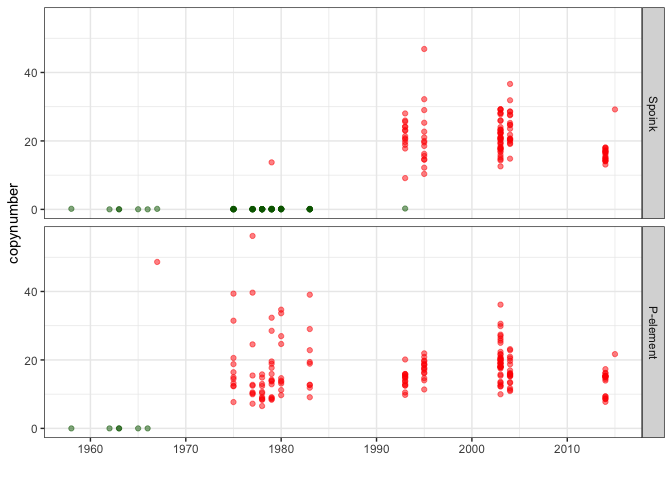

Drosophila melanogaster - Spoink invasion timing
================

``` r
suppressPackageStartupMessages(library(tidyverse))
suppressPackageStartupMessages(library(knitr))
suppressPackageStartupMessages(library(kableExtra))
suppressPackageStartupMessages(library(ggpubr))
suppressPackageStartupMessages(library(svglite))
theme_set(theme_bw())
```

``` r
meta_pool <- read_tsv("/Volumes/EXT-RICCARDO/Dmel-spoink/other-data/dmel-pool-providence/dmel-full-metadata.txt")
```

    ## Rows: 183 Columns: 6
    ## ── Column specification ────────────────────────────────────────────────────────
    ## Delimiter: "\t"
    ## chr (3): strain, Sample, location
    ## dbl (3): year, lat, lon
    ## 
    ## ℹ Use `spec()` to retrieve the full column specification for this data.
    ## ℹ Specify the column types or set `show_col_types = FALSE` to quiet this message.

``` r
pool <- read_csv("/Volumes/EXT-RICCARDO/analysis/csv/Dmel/P-ele/D_mel_pool+gdl.csv", show_col_types = FALSE) %>% filter(Sample!="Sample") %>% inner_join(meta_pool, by="Sample") %>% type_convert() %>% distinct() %>% mutate(presence = ifelse(HQ_reads > 2, "present", "absent"))
```

    ## Warning: One or more parsing issues, call `problems()` on your data frame for details,
    ## e.g.:
    ##   dat <- vroom(...)
    ##   problems(dat)

    ## 
    ## ── Column specification ────────────────────────────────────────────────────────
    ## cols(
    ##   Sample = col_character(),
    ##   TE = col_character(),
    ##   strain = col_character(),
    ##   location = col_character()
    ## )

``` r
after1940 <- pool %>% filter(year>1940)
spoink_pool <- after1940 %>% filter(TE=="gypsy-7-sim1") %>% arrange(year)
P_pool <- after1940 %>% filter(TE=="PPI251") %>% arrange(year)
(TEs <- bind_rows(spoink_pool, P_pool) %>% mutate(TE = ifelse(TE=="gypsy-7-sim1", "Spoink", "P-element")))
```

    ## # A tibble: 354 × 10
    ##    Sample    TE    All_reads HQ_reads strain  year location   lat   lon presence
    ##    <chr>     <chr>     <dbl>    <dbl> <chr>  <dbl> <chr>    <dbl> <dbl> <chr>   
    ##  1 SRR11846… Spoi…      3.7      0.17 Hikon…  1958 Japan       35   138 absent  
    ##  2 SRR457698 Spoi…      6.07     0.02 A2(BO…  1962 Bogota,…     5   -74 absent  
    ##  3 SRR457701 Spoi…      8.44     0.03 B4(RV…  1963 Califor…    36  -119 absent  
    ##  4 SRR457707 Spoi…      7.13     0.03 A4(KS…  1963 South A…   -30    24 absent  
    ##  5 SRR457669 Spoi…      5.88     0.04 A5(VA…  1965 Athens,…    38    24 absent  
    ##  6 SRR457697 Spoi…      5.19     0.02 A6(wi…  1966 Georgia…    32   -83 absent  
    ##  7 SRR11846… Spoi…      3.51     0.15 Harwi…  1967 Harwich…    52     1 absent  
    ##  8 SRR11460… Spoi…      2.5      0.12 Pi2     1975 <NA>        NA    NA absent  
    ##  9 SRR13257… Spoi…      1.71     0.12 RI75-1  1975 Provide…    42   -71 absent  
    ## 10 SRR14293… Spoi…      2.64     0.08 RI75-…  1975 Provide…    42   -71 absent  
    ## # ℹ 344 more rows

``` r
TEs$TE <- factor(TEs$TE, levels = c("Spoink", "P-element"))

#(plot_spoink <- ggplot(spoink_pool, aes(x=year, y=HQ_reads, color=presence)) + geom_point(alpha=0.5) +
    #labs(y = "copynumber", x = "collection year") + ggtitle("spoink") +
    #scale_x_continuous(breaks = seq(1940, max(spoink_pool$year), by = 10), labels = seq(1940, max(spoink_pool$year), by = 10))+
    #scale_color_manual(values=c("darkgreen", "red"))+
    #theme(plot.title = element_text(hjust = 0.5)))

(timeline <- ggplot(TEs, aes(x=year, y=HQ_reads, color=presence)) + geom_point(alpha=0.5) +
    labs(y = "copynumber", x = "") +
    scale_x_continuous(breaks = seq(1940, max(spoink_pool$year), by = 10), labels = seq(1940, max(spoink_pool$year), by = 10))+
    scale_color_manual(values=c("darkgreen", "red"))+
    facet_grid(TE ~ .)+
    theme(legend.position = "none"))
```

<!-- -->

``` r
#ggsave("/Volumes/EXT-RICCARDO/Dmel-spoink/paper/figure3-timing/timing-invasion.svg", plot = timeline, width = 12)
```
